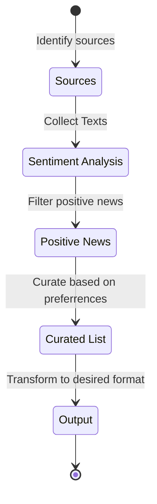

# Good Times

An application that brings personalized positive news of the world to you.

## Identifying sources

Phase I: Static list of websites.

Next: Dynamic list derived from preferences.

## Collecting texts

Phase I: Web Scraping.

## Sentiment Analysis

Phase I: Use an open-source model (TODO: Research)

## Personalization/Curation

Phase I: AI agent?

## Output transformation

Phase I: Website

Next: Audio

## Future

- Direct messaging of curated content.
